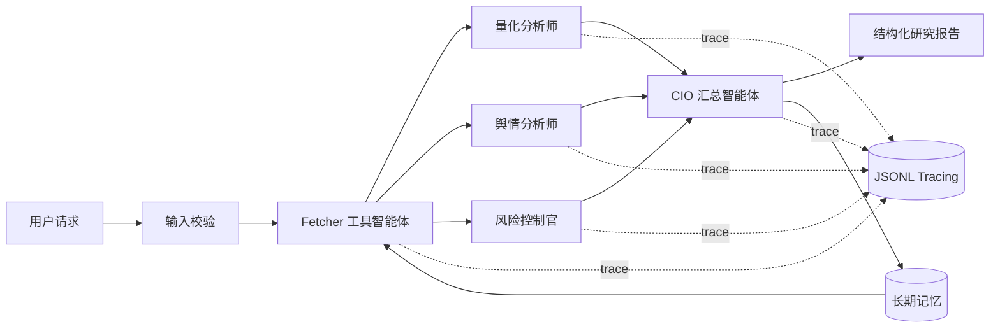

# StockMind：A 股多智能体投研与风险解释系统

课程仓库：`zmy20030528/cs599-project`

## 项目简介

StockMind 是一个面向教学研究的多智能体股票分析系统，通过“数据工具 → 量化/舆情/风控专家 → CIO 汇总 → 长期记忆”的可追踪工作流，解决单模型分析证据混杂、过程不可见和结论难复核的问题。**所有输出仅供课程研究，不构成投资建议。**

## 方向

方向一：Agentic AI 原生开发。

核心技术要素覆盖：SDD 规格驱动开发、Function Calling 风格工具、LangGraph 状态管理、多智能体协作、RAG 长期记忆、Tracing 与 Benchmark（6 项）。

## 技术栈

- AI IDE：Trae CN / Codex（开发协作；最终报告需补个人使用截图）
- LLM：DeepSeek OpenAI-compatible API；内置确定性离线 Demo
- Agent 框架：LangGraph；无依赖环境自动使用等价本地 DAG
- 记忆：可替换式 JSONL 检索记忆（后续可接 Chroma/pgvector）
- 工具协议：Python Function Calling 风格 Tool Adapter
- 可观测性：节点级 JSONL Trace + Benchmark
- 工程化：Docker、unittest/pytest、环境变量密钥管理

## 架构



## 目录结构

```text
.
├── docs/                 # Specs、架构、评估与大作业报告源稿
├── scripts/benchmark.py  # 可复现性能/行为基准
├── src/
│   ├── agents.py         # Fetcher、三专家、CIO、记忆节点
│   ├── graph.py          # LangGraph DAG 与离线等价执行器
│   ├── tools.py          # 参数校验和数据工具适配器
│   ├── rag.py            # 持久化检索记忆
│   ├── llm.py            # Demo/DeepSeek 模型网关
│   └── observability.py  # 节点级追踪
├── tests/                # 工具、工作流、记忆回注测试
├── langchain_merrary.py  # CLI 入口（保留原项目文件名兼容）
└── Dockerfile
```

## 环境搭建

要求 Python 3.10+。

```bash
python -m venv .venv
# Windows: .venv\Scripts\activate
# macOS/Linux: source .venv/bin/activate
pip install -r requirements.txt
```

离线演示无需 Key：

```bash
python langchain_merrary.py --mode demo --stock-code 600519 --start 20260101 --end 20260622
```

在线模式使用 DeepSeek、Sina 实时行情，并可通过 Tavily 检索新闻；外部数据源失败时会退回带 `demo_fallback` 标识的数据：

```bash
copy .env.example .env    # Windows；macOS/Linux 使用 cp
# 在 .env 中填写 LLM_API_KEY；TAVILY_API_KEY 可选，严禁提交 .env
python langchain_merrary.py --mode live --stock-code 600519
```

Docker：

```bash
docker compose run --rm stock-agent
```

## 测试与评估

```bash
python -m unittest discover -s tests -v
python scripts/benchmark.py
```

验收口径见 [Product Spec](docs/product-spec.md)、[Architecture Spec](docs/architecture-spec.md)、[API Spec](docs/api-spec.md) 和 [评估说明](docs/evaluation.md)。运行后 `data/traces.jsonl` 保存节点耗时与状态，`data/memory.jsonl` 保存跨会话记忆。

## 改造来源与学术诚信

本项目基于原始 `Stock_forecast-master` 教学代码重构。原代码采用 LangGraph、通义千问、Tavily、AKShare、Chroma 与 BGE；本仓库重新实现了配置、模型网关、工具适配、记忆、可观测性、测试和文档。引用的第三方框架按其许可证使用，未复制外部项目业务代码。提交前请按学校要求进行查重，并在报告中如实说明 AI IDE 的使用范围。

## 项目状态

- [x] Proposal / Specs
- [x] MVP（离线闭环、记忆、Tracing）
- [x] Final 代码与测试
- [x] 本人真实 AI IDE 截图与带书签最终 PDF
- [ ] 创建 `cs599-project` GitHub 仓库并按可见性配置 LICENSE/Collaborator
