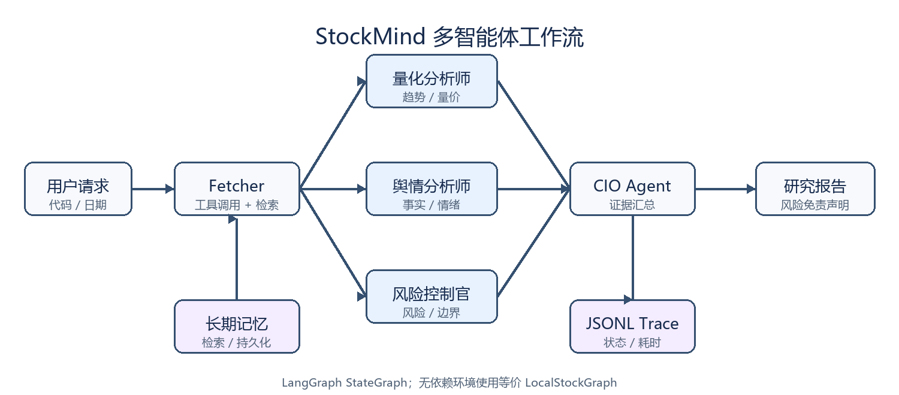
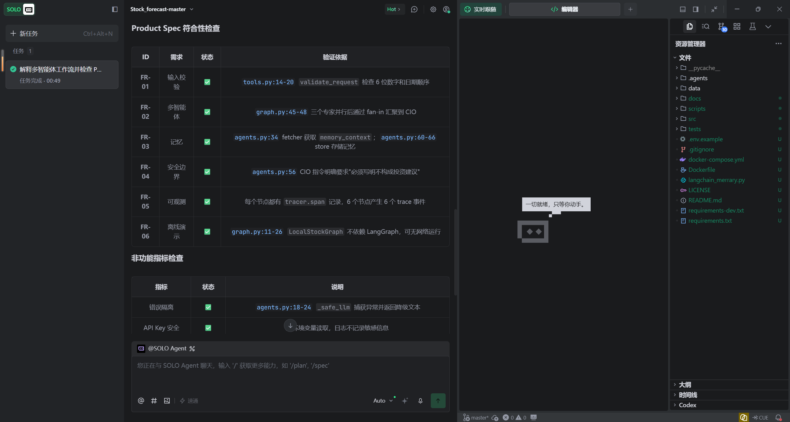
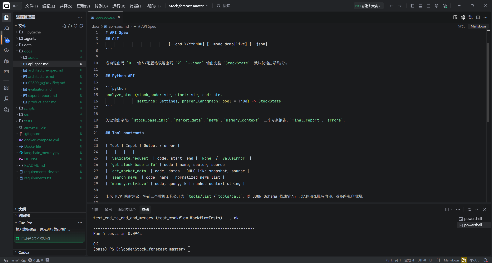
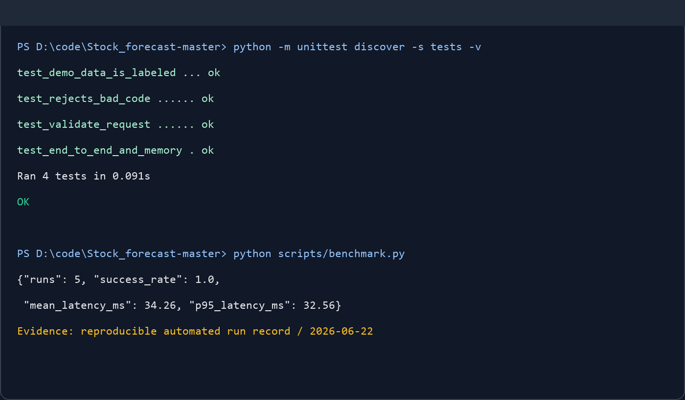
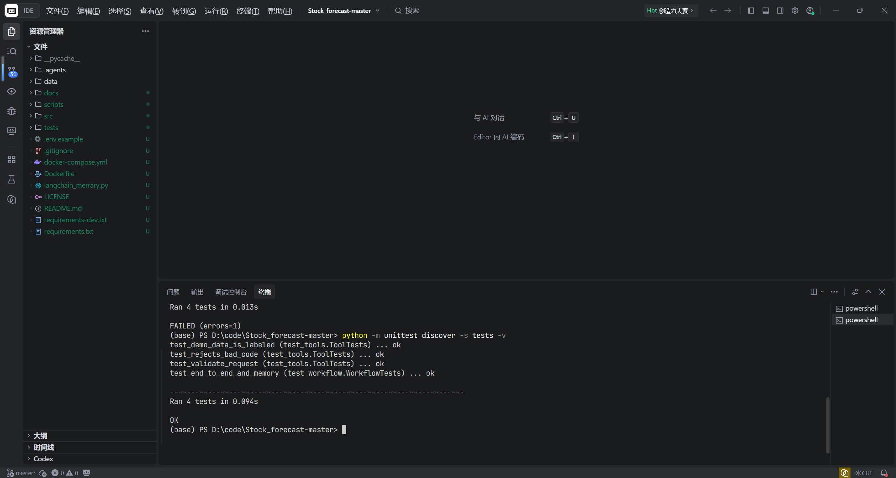

# 封面 {.unnumbered}

| 字段 | 内容 |
|---|---|
| 课程名称 | 企业级应用软件设计与开发 |
| 项目名称 | StockMind：A 股多智能体投研与风险解释系统 |
| 方向 | 方向一：Agentic AI 原生开发 |
| 学号 | 2025302927 |
| 姓名 | 张铭洋 |
| 专业 | 计算机技术 |
| 指导教师 | 戚欣 |
| 提交日期 | 2026 年 6 月 22 日 |

> 本 Markdown 已配置 Pandoc 目录元数据；使用 `--toc` 和支持书签的 PDF 引擎导出。

\newpage

# 目录 {.unnumbered}

[[TOC]]

\newpage

# 一、选题背景与设计思想

## 1.1 问题定义

通用大模型可以快速生成股票分析，但常把行情事实、新闻观点和模型推断混写，缺乏风险制衡、历史连续性和运行证据。对课程项目而言，依赖外部 API 的单链路还容易在现场因网络或额度失败。

## 1.2 项目价值与技术路线

StockMind 将任务拆给 Fetcher、量化、舆情、风控和 CIO，多观点汇聚后才输出结论。系统以内置 Demo 保证可复现，以 Live 网关连接 DeepSeek；用检索记忆支持跨会话，用节点 Trace 支持复盘。系统只做教学研究，不做交易或收益承诺。

## 1.3 与单模型方案对比

| 维度 | 改造前：单脚本/单模型 | 改造后：StockMind |
|---|---|---|
| 推理职责 | 混合在一个提示词 | 三专家独立、CIO 汇聚 |
| 状态 | 临时变量 | TypedDict 统一契约 |
| 记忆 | 无或重型依赖 | 可替换的持久化检索接口 |
| 故障 | Key 缺失即导入崩溃 | 延迟配置、节点降级 |
| 演示 | 强依赖网络 | 无 Key 离线闭环 |
| 评估 | 无 | 测试、Trace、Benchmark |

# 二、Specs 规格文档

SDD 流程为“问题/边界 → 可执行验收 → 状态/API 契约 → 实现 → 自动验证”。完整规格见 `product-spec.md`、`architecture-spec.md`、`api-spec.md`。核心验收编号 FR-01 至 FR-06 均映射到测试或基准命令，避免文档只描述愿望而无法验证。

# 三、系统架构与设计

## 3.1 核心架构

{ width=95% }

## 3.2 设计要点

专家节点互不写同一字段，因此适合并行；CIO 是同步汇聚点。模型、工具、记忆和 Trace 均通过依赖注入进入 Agent，便于测试和替换。生产 LangGraph 与本地 DAG 拥有相同流程语义。

# 四、关键实现与代码展示

关键实现位于：`src/graph.py`（状态图）、`src/agents.py`（Agent 与降级）、`src/tools.py`（Function Calling 风格工具）、`src/rag.py`（记忆检索）、`src/observability.py`（Trace）。API Key 仅从 `.env`/环境变量读取。

## 4.1 AI IDE 使用记录

开发过程中使用 Trae CN 的 SOLO Agent 对多智能体工作流进行规格符合性审查。AI 依次读取 `graph.py`、Product Spec、Agent 与状态定义，对 FR-01 至 FR-06 给出逐项验证依据；本人再根据源代码和自动测试核对结论。图 4-1 展示了真实审查界面。

{ width=95% }

图 4-2 展示了在 Trae CN 中检查 API Spec、项目目录和测试输出的过程。规格先定义 CLI、Python API 和工具契约，再由实现与测试闭环验证，体现 SDD 的“规格—实现—验收”路径。

{ width=95% }

# 五、测试与评估

测试覆盖参数边界、数据来源标识、端到端 Agent DAG、记忆命中和 Trace。运行：

```bash
python -m unittest discover -s tests -v
python scripts/benchmark.py
```

本机实测结果为 4/4 自动测试通过；5 次离线 Demo 基准成功率 100%，平均耗时 34.26 ms，P95 为 32.56 ms。详细指标定义见 `evaluation.md`。

{ width=95% }

图 5-1 根据本项目实际执行结果制作，记录了 4/4 自动测试通过以及 5 次离线基准成功率 100%。它是可复现运行证据图，不冒充 Trae CN 界面截图；对应命令与原始指标均可在仓库中重新执行核验。

图 5-2 保留了真实调试轨迹：第一次运行因 Python 3.8 不支持部分内置泛型注解而失败；将 `StockState` 改为兼容写法后再次执行，四项测试全部通过。这一过程验证了系统的环境兼容性，也体现了通过失败证据定位并修复问题的工程方法。

{ width=95% }

# 六、系统升级与扩展

下一阶段按优先级：① 将 Tool Adapter 暴露为 MCP Server；② JSONL 迁移 Chroma/pgvector 并增加租户隔离；③ 增加事实核验与人工审批节点；④ FastAPI + SSE 流式界面；⑤ OpenTelemetry/LangSmith；⑥ 建立带人工标注的事实一致性与风险召回 Benchmark。若进入生产，还需采购合规行情源、权限审计、提示注入防御和灾备。

# 七、课程总结

本学期《企业级应用软件设计与开发（AI 驱动的软件开发与 Agentic AI）》课程的学习，彻底打破了我传统的软件开发认知，让我完成了从被动的代码编写者到主动的智能体编排者的思维蜕变。不同于传统编程课程侧重语法学习、功能代码实现的教学模式，本课程聚焦 AI 时代软件工程的全新范式，聚焦 Agentic AI 落地实践与企业级工程思维培养，让我在技术能力、工程思想、问题解决思维上均实现了全方位成长，同时也对课程教学有了自己的思考与建议。

在个人思维与认知成长层面，我最大的收获是摆脱了“代码实现即开发终点”的固有误区。过去进行软件开发，我的核心思路是根据需求逐行编写代码、完成功能调试，关注点仅局限于代码是否能运行、功能是否可实现，缺乏对系统架构、开发规范、迭代扩展性的思考，属于典型的“面向功能编码”。而通过本课程的系统学习与期末大作业的完整实战，我深刻理解了规格驱动开发（SDD）的核心价值，明白了企业级软件开发的核心不是堆砌代码，而是先定义规范、梳理架构、明确逻辑，再通过工具与智能体落地实现。

同时，我全面掌握了 Agentic AI 的核心底层逻辑，不再局限于只会调用 AI 工具的浅层使用模式。从前我对大模型、AI 工具的认知仅停留在代码补全、文本生成，而通过课程对 ReAct 推理机制、工具调用、记忆机制、多智能体协作的深入学习，我读懂了 AI 智能体的自主推理、状态管理与任务调度原理。在期末项目从零搭建 AI 智能体系统的过程中，我熟练运用 LangGraph 框架完成多步骤推理设计，结合检索式持久化存储实现长期记忆机制，依托 AI 原生 IDE 完成全流程开发，真正掌握了“编排智能体、让 AI 自主完成复杂工程任务”的核心能力，实现了从“手动编码”到“智能调度”的技术升级。

在工程实践能力上，课程让我建立了标准化、规范化的企业级开发思维。从 GitHub 仓库规范化管理、环境变量安全配置、工程目录标准化搭建，到项目分阶段迭代（Proposal–MVP–Final）、全方位测试评估与可观测性优化，整套开发流程贴合企业生产级项目标准。这让我摒弃了学生阶段随意编码、无规范、无迭代的开发陋习，深刻认识到软件工程的核心是规范、复用、迭代、可控，为今后从事 AI 软件工程、企业级系统开发相关工作奠定了扎实的工程基础。此外，通过了解 OpenClaw、Manus 等前沿智能体案例，我也及时接触了行业前沿技术动态，拓宽了技术视野，摆脱了闭门造车的学习模式。

基于本学期的学习体验，结合自身实战过程中的痛点，我对课程教学提出几点优化建议。首先，建议增加 Agentic AI 核心原理的实操精讲课时。课程理论内容覆盖全面，但 ReAct 推理底层逻辑、MCP 协议、多智能体协作冲突调度等前沿技术知识点难度较高，课堂理论讲解偏概括，新手落地实操时容易出现逻辑卡顿，可搭配小型随堂实操案例，帮助我们快速打通理论与实践的壁垒。

其次，建议丰富课程分层教学内容。目前课程内容兼顾理论与工程实战，但对于基础不同的同学适配性略有不足，可增设基础入门实操模块与高阶拓展模块。基础模块帮助零基础同学快速上手 AI IDE、Agent 框架使用；高阶模块可增加生产级项目部署、LLMOps 可观测性优化、智能体性能调优等进阶内容，适配不同层次学生的学习需求。

最后，建议增加阶段性项目答疑与互评环节。课程设置了清晰的项目迭代时间节点，但学生自主开发过程中遇到的架构设计、技术选型、代码调试问题难以及时得到解答。可在每个里程碑节点后增设小型答疑课，同时增加学生项目互评环节，让大家相互借鉴优秀架构设计与工程实现思路，取长补短，进一步提升整体实践能力。

总而言之，这门课程是我研究生阶段收获最大的实践性课程之一。它不仅让我掌握了 AI 驱动软件开发、智能体系统搭建的前沿技术，更重塑了我的软件工程思维，让我精准把握了 AI 时代软件开发的转型趋势。未来，我将继续深耕 Agentic AI 领域，持续优化自身的智能体编排与企业级系统开发能力，将课程所学的工程思维落地到更多项目实践中，不断弥补自身技术短板，适应行业技术发展趋势。

# 参考资料与开源声明

1. LangGraph 官方文档，https://langchain-ai.github.io/langgraph/
2. DeepSeek API 文档，https://api-docs.deepseek.com/
3. 原始 `Stock_forecast-master` 教学代码（本项目的改造基线）。
4. 本项目使用 MIT License；第三方依赖遵循各自许可证。AI 工具参与了代码与文档辅助，所有内容应由提交者复核、实测并承担责任。
