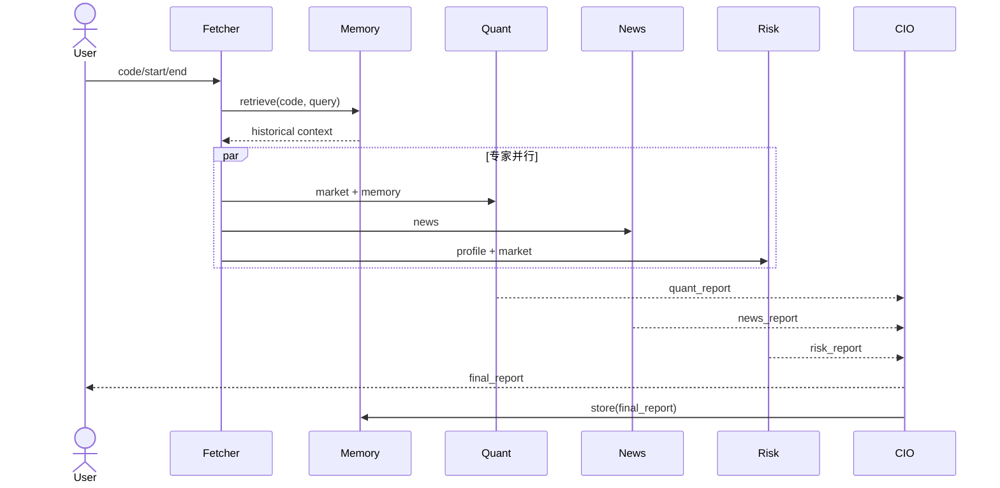

# Architecture Spec

## 1. 决策摘要

采用六节点 DAG。Fetcher 执行工具与记忆检索；量化、舆情、风控三个节点并行；CIO 仅在三者汇聚后执行；最后持久化结果。安装 LangGraph 时使用 `StateGraph`，最小环境使用具有相同拓扑语义的本地执行器，保证答辩可用性。

## 2. Agent 交互流程

## 3. 状态与数据流

`StockState` 是唯一共享契约。节点只返回自己负责的字段，避免隐式全局变量。外部模型与工具通过构造注入，使 Demo/Live、测试替身和未来 MCP Server 可以替换而不改 Agent。

| 层 | 组件 | 责任 |
|---|---|---|
| Interface | CLI / future API | 参数接收、输出格式 |
| Orchestration | graph.py | 状态机、并行、汇聚 |
| Agent | agents.py | 角色提示、降级、证据整合 |
| Capability | tools.py / llm.py | 数据工具、模型网关 |
| Infrastructure | rag.py / observability.py | 记忆、追踪 |

## 4. 故障与安全设计

- 配置延迟加载；Demo 不要求 Key，Live 缺 Key 时 fail-fast。
- 专家 LLM 调用隔离，失败写入 `errors` 并返回可见降级结果。
- Trace 仅记录 request ID、节点、状态、错误类型与耗时，不记录 Key。
- 当前 JSONL 适合单机课程演示；生产环境应换成 pgvector/Chroma、OpenTelemetry 与带锁存储。

## 5. 扩展路径

Tool Adapter 可迁移成 MCP Server；记忆接口可接向量库；CLI 可增加 FastAPI/SSE；CIO 前可增加事实核验 Agent 和 human-in-the-loop 审批；Trace 可上报 LangSmith/OpenTelemetry。

